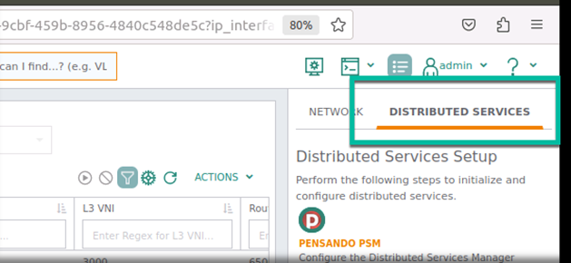
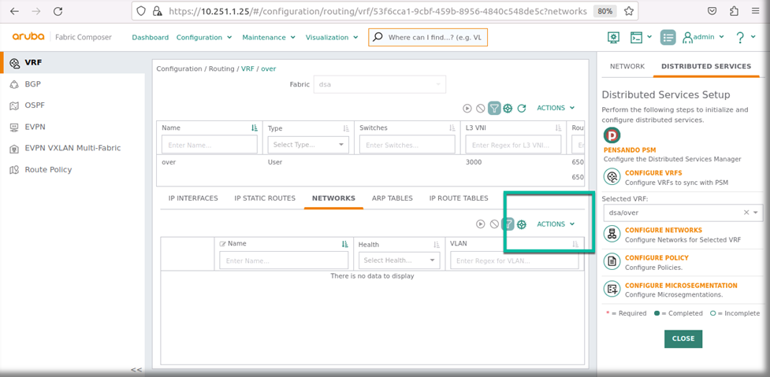
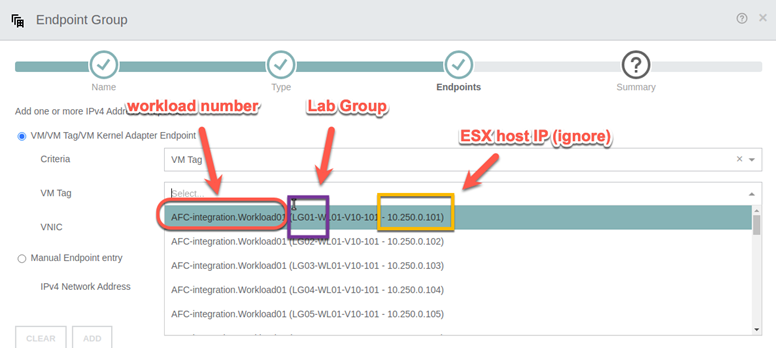
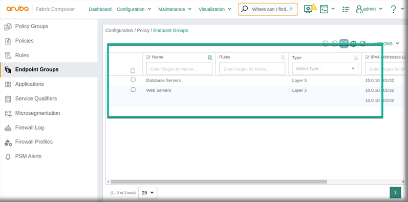
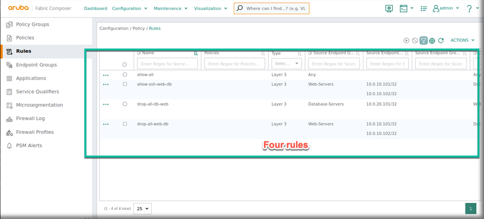

# Lab 3 - Create and Deploy a Policy  

## Lab Overview
Lab time:  30 minutes  

With all the systems in place, we can now leverage the various components to create a policy that can be deployed from a single pane of glass to multiple switches within the fabric.  

## Lab 3.1 - Redirect VLANs to DSM  

### Description  
The first step is to Configure the VRFs to sync with the Policy Service Manager that will utilize the defined networks.  

### Validate   
1. In the Guided Setup Pane, switch from the **Network** tab to the **Distributed Services** tab.  _Be sure to switch over to Distributed Services from the Network Tab_!  

  
_Fig. Distributed Services Menu_  

2. Click **Configure VRFs** to navigate to the VRFs page under **Configuration/Routing**  

3. In the Configure VRFs page, within the right-hand pane for Distributed Services, choose **dsa/over** as the selected VRF in the **Distributed Services Setup** drop-down, then select **Configure Networks** just below the VRF selection drop-down menu

```{note}
Be sure to select the dsa/over VRF
```  

  
_Fig. dsa/over_  

```{note}
Also accessed via Configuration/Routing/VRF - [over] - (3 dots on left) /Networks/From Networks Tab/Actions Menu (mid-right) - Add
```  

4. In the **ACTIONS** menu under the **Networks** tab, click **Add** and configure the following for VLAN 10.  

  
_Fig. Add Redirect_  

|||
|---|---|
| Step 1: Name ||  
| Name | vlan10 |  
| Description | vlan10 |  
| Click **NEXT** to continue ||  

|||
|---|---|
| Step 2: Settings ||  
| VLAN | 10 |  
| Click **NEXT** to continue ||  
| Click **Apply** ||  

5. Repeat the previous step, but for VLAN 20.  In the **ACTIONS** menu under the **Networks** tab, click **Add** and configure the following for VLAN 20.  

|||
|---|---|
| Step 1: Name ||  
| Name | vlan20 |  
| Description | vlan20 |  
| Click **NEXT** to continue ||  

|||
|---|---|
| Step 2: Settings ||  
| VLAN | 20 |  
| Click **NEXT** to continue ||  
| Click **Apply** ||  

### Expected Results  

1. You should see the newly created networks under the Networks tab for the VRF in a green Healthy state.  

  
_Fig. VLANs Created_  

2. Verify the VLANs are in operation by using the embedded **CLI Command Tool** to verify their status.  

The command to execute against the leaf switches is:  
- ``show vlan``  
- VLANs 10 & 20 should be listed  

## Lab 3.2 Configure Endpoint Groups  

### Overview 
Endpoint group objects represent source and destination IP addresses referenced in firewall rules that can represent one or multiple devices. **Dynamic** endpoint groups can be **auto-populated** based on the assignment of **vSphere Tags** to VMs identified through AFC’s vCenter integration along with the PSM. All VMs assigned the same tag should be auto-populated as a member of the dynamic group when on a **distributed vSwitch**.  _When member IP addresses change or tag assignments are changed in vCenter, dynamic group objects are updated automatically_.  

```{note}
In this workshop you will see workloads that are learned from vSphere. You can ignore them, and create your own! 
```  

### Validate  
1. In the **Guided Setup Pane**, under the **Distributed Services** tab, click **Configure Policy**, followed by **Endpoint Groups** on the left-hand menu.  

  
_Fig. Configure Policy_  

```{note}
Also accessed via Configuration/Policy/Endpoint Groups  
```  

```{note}
To proceed with manual endpoint group creation, begin by clicking Add under the ACTIONS Menu in the top-right under Configuration/Policy/Endpoint Groups/Actions Menu (top-right)/Add
```  

  
_Fig. Add Enpoint Group_  

3. Enter the following configuration to create an Endoint Group for Workload01 & Workload02:

|||
|---|---|
| Step 1: Name ||  
| Name | Web Servers |  
| Description | Web Server EPG |  
| Click **NEXT** to continue ||  

|||
|---|---|
| Step 2: Type ||  
| Type | Layer 3 ***(default setting)*** |  
| Click **NEXT** to continue ||  

|||
|---|---|
| Step 3: Endpoints ||  
| Criteria | VM Tag ***(default setting)*** |  
| VM Tag | AFC-integration.Workload01 _(select from the dropdown)_ |  
| VNIC | Network adapter 2 ||
| Scroll down and click **Add** ||  

  
_Fig. VM Tag_  

```{note}
Stay on the Endpoints page and repeat the process again to add Workload02, you will have two workloads in this Endpoint Group!  
```  

|||
|---|---|
| Step 4: Endpoints ||  
| Criteria | VM Tag ***(default setting)*** |  
| VM Tag | AFC-integration.Workload02 _(select from the dropdown)_ |  
| VNIC | Network adapter 2 ||
| Scroll down and click **Add** ||  
| Click **Next** to continue ||  

|||
|---|---|
| Step 5: Summary ||  
| On the Summary page, verify the settings, then click **Apply** to save the configuration. |  

  
_Fig. Web Server EPG_  

4. Now create a second Endpoint Group for the Database Servers, by clicking **Add** under the **ACTIONS** menu.  

|||
|---|---|
| Step 1: Name ||  
| Name | Database-Servers |  
| Description | Database-Servers EPG |  
| Click **NEXT** to continue ||  

|||
|---|---|
| Step 2: Type ||  
| Type | Layer 3 ***(default setting)*** |  
| Click **NEXT** to continue ||  

|||
|---|---|
| Step 3: Endpoints ||  
| Criteria | VM Tag ***(default setting)*** |  
| VM Tag | AFC-integration.Workload03 _(select from the dropdown)_ |  
| VNIC | Network adapter 2 ||
| Scroll down and click **Add** ||  
| On the Summary page, verify the settings, then click **Apply** to save the configuration. |  


### Expected Results  

Verify the Endpoint Groups were created successfully, as shown in the following screenshot.  

  
_Fig. Endpoint Groups_  

## Lab 3.3 Create Firewall Rules  

### Description  
The goals of the rules that will be used to enforce the policy for this workshop, seek to achieve three things in this scenario:  

- Allow **workload01** and **workload02** to SSH into **workload03**  
- Block everything else between these two workloads  
- Allow everything else

### Validate  
1. Under the **Configuration** menu, go to **Policy/Rules**  

  
_Fig. Policy Rules Menu_  

2. First, we will create the ``Allow SSH Web to DB Rule``.  Under **ACTIONS**, click **ADD** to create a rule, and configure the following parameters.  

```{note}
Stick to lower-case & NO SPACES for the Rule Name (may result in errors when applying these rules to a policy if not entered the same as below as the UI does not restrict case at this time.)
```  

  
_Fig. Rule Worklow_  

|||  
|---|---|  
| Step 1: Name ||  
| Name | allow-ssh-web-db |  
| Description | Allow SSH between Web and Database Servers |  
| Click **NEXT** to continue ||  

|||  
|---|---|  
| Step 2: Settings ||  
| Type | Layer 3 |  
| Action | Allow ***(default setting)*** |  
| Click **NEXT** to continue ||  

|||  
|---|---|  
| Step 3: Endpoint Groups ||  
| Source Endpoint Group | Web-Servers |  
| Destination Endpoint Group | Database-Servers |  
| Click **NEXT** to continue ||  

|||  
|---|---|  
| Step 4: Applications and Service Qualifiers  ||  
| Applications | ***leave empty*** |  
| Service Qualifiers | SSH ***(type ssh)*** |  
| Click **NEXT** to continue ||  
| Review the Summary and click **Apply** ||  

3. Now we will create the second rule: ``Web to Database Rule``.  Under **ACTIONS**, click **ADD** to create a rule, and configure the following parameters.  

|||  
|---|---|  
| Step 1: Name ||  
| Name | drop-all-web-db |  
| Description | Block all other traffic between web and database |  
| Click **NEXT** to continue ||  

|||  
|---|---|  
| Step 2: Settings ||  
| Type | Layer 3 |  
| Action | Drop |  
| Click **NEXT** to continue ||  

|||  
|---|---|  
| Step 3: Endpoint Groups ||  
| Source Endpoint Group | Web-Servers |  
| Destination Endpoint Group | Database-Servers |  
| Click **NEXT** to continue ||  

|||  
|---|---|  
| Step 4: Applications and Service Qualifiers  ||  
| Applications | ***leave empty*** |  
| Service Qualifiers | all |  
| Click **NEXT** to continue ||  
| Review the Summary and click **Apply** ||  

4. Now we will create the third rule: ``Database to Web Rule``.  Under **ACTIONS**, click **ADD** to create a rule, and configure the following parameters.  

|||  
|---|---|  
| Step 1: Name ||  
| Name | drop-all-db-web |  
| Description | Block all other traffic between database and web |  
| Click **NEXT** to continue ||  

|||  
|---|---|  
| Step 2: Settings ||  
| Type | Layer 3 |  
| Action | Drop |  
| Click **NEXT** to continue ||  

|||  
|---|---|  
| Step 3: Endpoint Groups ||  
| Source Endpoint Group | Web-Servers |  
| Destination Endpoint Group | Database-Servers |  
| Click **NEXT** to continue ||  

|||  
|---|---|  
| Step 4: Applications and Service Qualifiers  ||  
| Applications | ***leave empty*** |  
| Service Qualifiers | all |  
| Click **NEXT** to continue ||  
| Review the Summary and click **Apply** ||  

5. Now we will create the last and catch all rule: ``Allow Any to Any Rule``.  Under **ACTIONS**, click **ADD** to create a rule, and configure the following parameters.  

|||  
|---|---|  
| Step 1: Name ||  
| Name | allow-all |  
| Description | Allow all traffic |  
| Click **NEXT** to continue ||  

|||  
|---|---|  
| Step 2: Settings ||  
| Type | Layer 3 |  
| Action | Allow |  
| Click **NEXT** to continue ||  

|||  
|---|---|  
| Step 3: Endpoint Groups ||  
| Source Endpoint Group | ***leave blank*** |  
| Destination Endpoint Group | ***leave blank*** |  
| Click **NEXT** to continue ||  

|||  
|---|---|  
| Step 4: Applications and Service Qualifiers  ||  
| Applications | ***leave empty*** |  
| Service Qualifiers | all |  
| Click **NEXT** to continue ||  
| Review the Summary and click **Apply** ||  

### Expected Results  
When finished, you should see four rules like in the screenshot below.  

  
_Fig. Rule List_  

## Lab 3.4 Create Firewall Policy  

### Description  

### Validate  

### Expected Results  


## Lab 3.5  

### Description  

### Validate  

### Expected Results  

