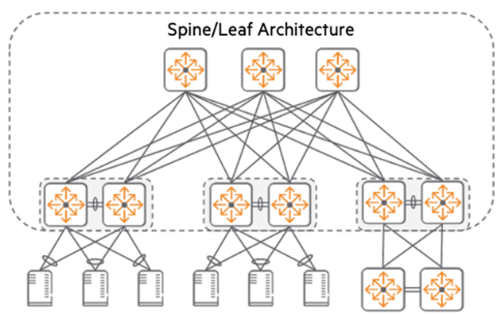

# Lab 4 - Test the Policy  

## Lab Overview
Lab time:  15 minutes  

The spine leaf architecture provides for massive bandwidth between racks in the data center. Another reason for deploying a spine leaf is resiliency. The spine switches connect to leafs, the leafs, to the spines. The connections between them, are routed IP layer 3 links. They will not pass VLAN information. To get layer 2 traffic between the leafs, VXLAN must be used to create an overlay network.  

  
_Fig. Spine Leaf Architecture_  

```{note}
VSX Configuration is being skipped in this workshop due to limited hardware availability, but it is always recommended to configure a high-availability setup for critical server workloads. Refer to our Validated Solutions Guide (VSG) to learn more:  

https://www.arubanetworks.com/techdocs/VSG/docs/050-dc-deploy/esp-dc-deploy-120-fabric-deploy/#configure-vsx-on-leaf-switches
```  

You were _assigned a pod number_ at the start of the workshop. Add a zero in front of it and it becomes the _lab group number_. In the third octet of the IP address, start with the number 2 and add your lab group number to it. As an example, user1 = lab group 01 – 3rd octet, 201. The AFC IP for lab group 01 would be 10.250.201.30

## Lab 4.1 - Configure the Overlay  

### Description  

### Validate   

### Expected Results  
